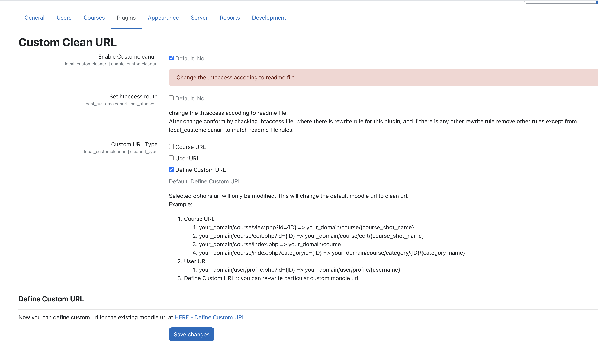
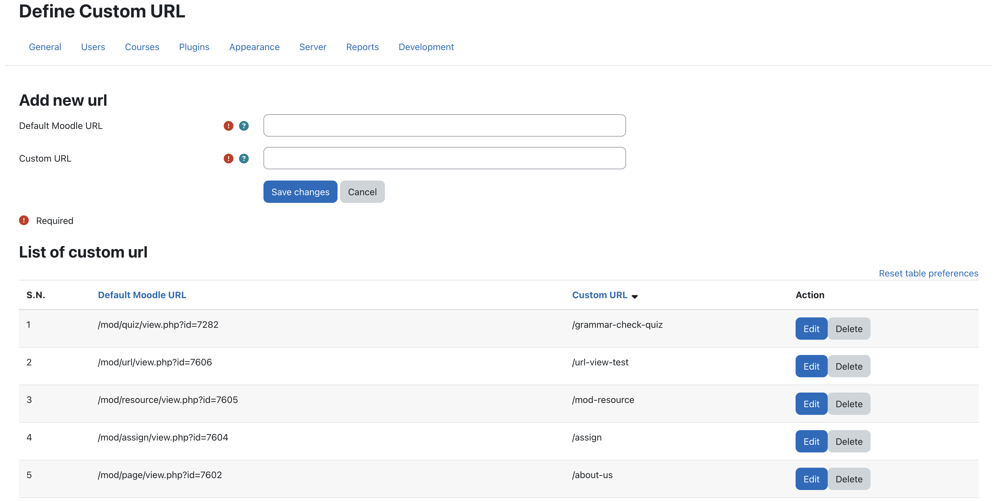
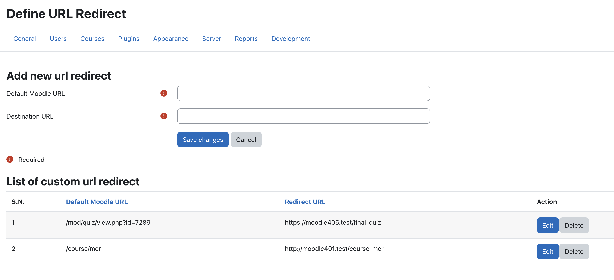

# customcleanurl
Customcleanurl main idea is to convert the moodle url in more user readable format and SEO friendly url. Also provide custom url define for existing moodle url and 404 page template. It also provide the old url redirect to new/next url.

## For Example:
1. Course View Page URL
    your_domain/course/view.php?id=ID => your_domain/course/course_short_name
2. Course Category Page URL
    your_domain/course/index.php?categoryid=ID => your_domain/course/category/ID/category_name
3. Course Edit Page URL
    your_domain/course/edit.php?id=ID => your_domain/course/edit/course_short_name
4. User Profile URL
    your_domain/user/profile.php?id=ID => your_domain/user/profile/username
5. Other as defined like: 
    your_domain/mod/page/view.php?id=11 => your_domain/about-us

## Installation
You can download as a zip from github then extract into your_moodle/local/customcleanurl/

## Modify .htaccess file
Plugin require modifcation of the .htaccess file for redirect, For this we need to add the following rules:
```
# BEGIN_MOODLE_LOCAL_CUSTOMCLEANURL
# DO NOT EDIT LOCAL_CUSTOMCLEANURL ROUTE

RewriteEngine On
RewriteBase /
RewriteCond %{REQUEST_FILENAME} !-f
RewriteCond %{REQUEST_FILENAME} !-d
RewriteRule ^(.*)$ /local/customcleanurl/route.php [L]
ErrorDocument 403 /local/customcleanurl/404.php
ErrorDocument 404 /local/customcleanurl/404.php

# DO NOT EDIT LOCAL_CUSTOMCLEANURL ROUTE
# END_MOODLE_LOCAL_CUSTOMCLEANURL
```

## Screenshot



